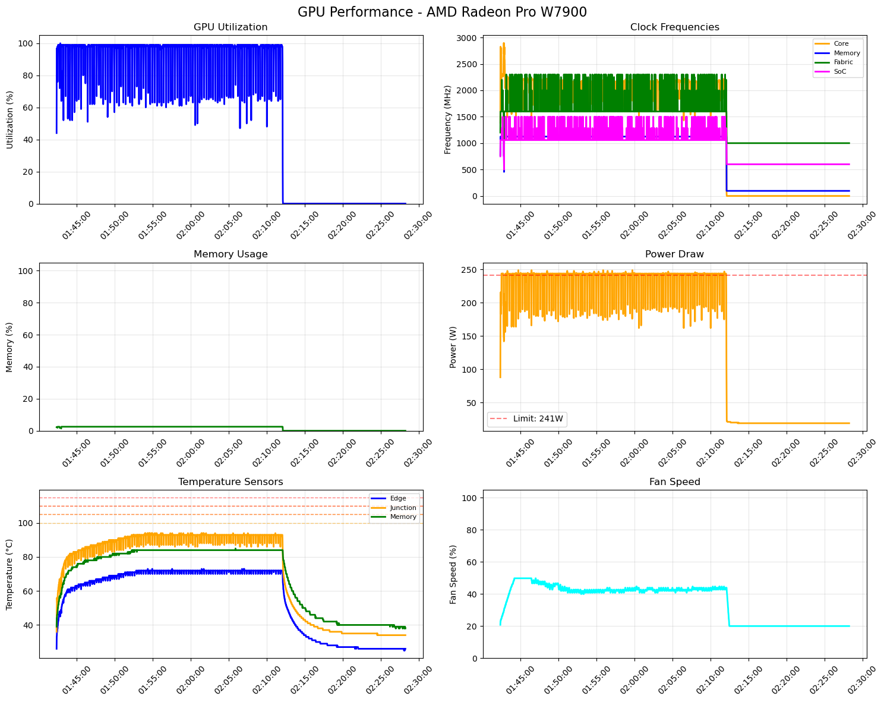

# gputop

I got tired of being told to use different tools to monitor one vendor
GPU or inference device against another so this is my effort to provide
a unified front to this in a way I think makse sense:

  * json collection while we use console monitoring
  * final png collection
  * multi-GPU / accelerator device

## Example Run

Here's example output from a test run monitoring ResNet-18 training using [AdamWPrune](https://github.com/mcgrof/AdamWPrune) on an AMD Radeon Pro W7900:

### Performance Plots



### Detailed Summary

```
GPU Performance Summary
========================

GPU: AMD Radeon Pro W7900
Type: amd
Duration: 2471 seconds
Start: 2025-08-27T01:42:19.766109
End: 2025-08-27T02:28:15.230642

GPU Utilization:
  Average: 63.6%
  Max: 100.0%
  Min: 0.0%

Memory Usage:
  Average: 1.7%
  Max: 2.6%
  Min: 0.1%

Temperature Sensors:
  Edge:
    Average: 56.3°C
    Max: 73.0°C
    Min: 25.0°C
  Junction:
    Average: 72.7°C
    Max: 94.0°C
    Min: 34.0°C
  Memory:
    Average: 69.1°C
    Max: 85.0°C
    Min: 38.0°C

Power Draw:
  Average: 164.6W
  Max: 249.0W
  Min: 19.0W
```
